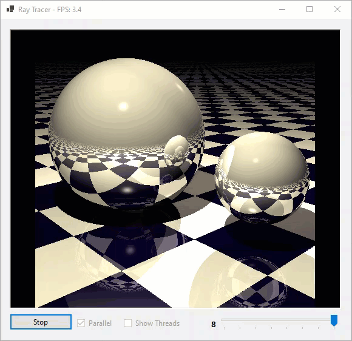

---
languages:
- csharp
products:
- dotnet
- dotnet-core
- windows-forms
page_type: sample
name: ".NET Core parallel animated ray-traced bouncing ball"
urlFragment: "parallel-programming-winforms-raytracer-cs"
description: "A .NET Core WinForms application that demonstrates an animated, ray-traced bouncing ball with parallel programming."
---

# .NET Core parallel animated ray-traced bouncing ball

The sample source code is a .NET Core WinForms application written in C#, that provides an animated, ray-traced bouncing ball. Sequential and parallel implementations are provided, as is a special parallel implementation that colors the animated image based on which thread was used to calculate which regions. For more information, see [Updates on .NET Core Windows Forms designer](https://devblogs.microsoft.com/dotnet/updates-on-net-core-windows-forms-designer/).

## Demo

## Sample prerequisites

This sample is written in C# and targets .NET Core 3.1. It requires the [.NET Core 3.1 SDK](https://dotnet.microsoft.com/download/dotnet-core/3.1).

## Types and members in use

The sample source code uses the following types and members:

- `Parallel.For`
- `ParallelOptions`
  - `CancellationToken`
  - `MaxDegreeOfParallelism`

## Building the sample

The source code includes an MSBuild project file for C# (a *.csproj* file) that targets .NET Core 3.1. After you download the *.zip* file containing the example code, create a directory and select **Download ZIP** to download the sample code files to your computer. To build the example:

1. Download the *.zip* file containing.
1. Create the directory to which you want to copy the files.
1. Copy the files from the *.zip* file to the directory you just created.
1. If you are using Visual Studio 2019:
   1. In Visual Studio, select **Open a project or solution** (or **File** > **Open** > **Project/Solution** from the Visual Studio menu.
   1. Select **Debug** > **Start Debugging** from the Visual Studio menu to build and launch the application.
1. If you are working from the command line:
   1. Navigate to the directory that contains the sample.
   1. Type in the command `dotnet run` to build and launch the application.
